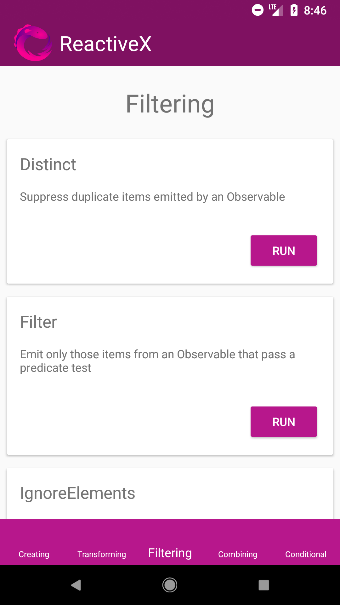

# Rxjava2-operators
The main idea about this repo is just to practice Rxjava operators by some simple examples. Operators are all introduced in [ReactiveX](http://reactivex.io/documentation/operators.html) and by means of marble diagrams you can understand the way they work. So now it's time to study them through the code. Here all operators are categorized into 5 fragments to introduce each operator by a card and by clicking on each card, the operator will be called by its predefined values and eventually, the emitted values will be printed to the console.

## Acknowledgments

* [ReactiveX](http://reactivex.io/documentation/operators.html) for its best words to describe Rxjava
